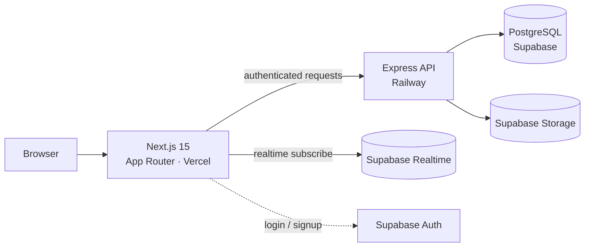

# DormSy

**A campus-only marketplace where college students buy, sell, and give away dorm essentials, without leaving campus or trusting a stranger.**

<!-- FILL IN: replace with your real links. Delete any line you don't have. -->
🔗 **[Live App](https://getdormsy.com)** · 🎥 **[2-min Demo](https://link-to-demo-video)**

<!-- FILL IN: add a screenshot or GIF here. This is the single highest-impact thing in this file. -->


---

## The problem

Every semester, students throw away furniture, mini-fridges, and textbooks while other students buy the same items new. The existing options don't work well for a small campus:

- **Facebook Marketplace / Craigslist** — anyone can join, so you're meeting strangers off-campus to trade a $20 desk lamp.
- **Campus Facebook groups** — no search, no categories, listings disappear into the feed within a day.

DormSy restricts access to verified students at a single college. Everyone on the platform is someone you could meet in the library in ten minutes.

<!-- FILL IN: if you have any traction numbers, put them here. Even small ones are worth more than none. -->
<!-- Example: Built and launched at Luther College. XX registered users, XX listings posted, partnerships with the Center for Sustainability and Student Senate. -->

---

## Features

- **Verified campus-only signup** — registration is restricted to `@luther.edu` addresses with email confirmation, so every account belongs to a real student
- **Listings with image upload** — multi-image posts backed by object storage, with categories and search
- **Real-time messaging** — buyers and sellers coordinate in-app instead of exchanging phone numbers
<!-- FILL IN: add or remove features to match what you actually built. Be specific — "saved listings and search filters" beats "user features". -->

---

## Architecture



The client never talks to the database directly. All writes go through the Express API, which is the only component holding the Supabase service role key.

---

## Technical decisions worth explaining

<!-- FILL IN: These are the reasons I inferred from your setup. Edit each one so it matches
     what you ACTUALLY did and why. This section is what engineers read most carefully —
     it is the difference between "built a CRUD app" and "made real engineering choices".
     Three to five items is the right number. -->

**Why a separate Express API instead of calling Supabase from the client**
Supabase can be queried directly from the browser, which is faster to build. I chose a backend layer because the service role key must never reach the client, and because business rules — ownership checks on edit and delete, listing validation, rate limiting — belong on the server where they can't be bypassed. The frontend holds only the public anon key.

**Enforcing campus-only access**
Access control happens at signup rather than at query time: the API validates the email domain before an account is created, and Supabase Auth requires email confirmation before the account becomes usable. This means the "only students" guarantee is enforced once, at the boundary, instead of being re-checked in every endpoint.

**Real-time messaging without building a socket server**
Rather than running a WebSocket service, messages are stored in Postgres and clients subscribe to inserts through Supabase Realtime. This kept the deployment to two services instead of three, at the cost of tying message delivery to the database layer.

**Image handling**
Listing photos are uploaded to Supabase Storage and referenced by URL in the database, keeping large binary data out of Postgres.

---

## Tech stack

| Layer | Technology |
|---|---|
| Frontend | Next.js 15 (App Router), Tailwind CSS v4 |
| Backend | Node.js, Express |
| Database | PostgreSQL (Supabase) |
| Auth | Supabase Auth (email + confirmation) |
| Storage | Supabase Storage |
| Real-time | Supabase Realtime |
| Hosting | Vercel (frontend), Railway (backend) |

---

## Status

<!-- FILL IN: be honest here. "Live with early users" and "feature-complete prototype"
     are both fine answers. Recruiters respect a clear status more than a vague one. -->
Live and in use at Luther College. Currently focused on growing listing density through direct outreach to campus organizations.

**Next up:** <!-- FILL IN: 2–3 planned items, e.g. saved searches, seller ratings, mobile layout pass -->

---

<details>
<summary><strong>Running locally</strong></summary>

### Prerequisites
- Node.js 18+
- A Supabase project (free tier is enough)

### 1. Database
1. Create a project at [supabase.com](https://supabase.com)
2. In **SQL Editor**, run `backend/src/migrations/001_schema.sql`
3. In **Storage**, create a public bucket named `dormsy`

### 2. Auth configuration
In the Supabase dashboard:
- **Authentication → Email Templates**: set the "Confirm signup" subject to `Verify your DormSy account` and the redirect to `http://localhost:3000/auth/callback`
- **Authentication → URL Configuration**: add `http://localhost:3000/**` to Redirect URLs
- **Authentication → Providers**: enable Email

### 3. Environment variables

**Frontend** (`frontend/.env.local`) — copy from `.env.local.example`

| Variable | Description |
|---|---|
| `NEXT_PUBLIC_SUPABASE_URL` | Supabase project URL |
| `NEXT_PUBLIC_SUPABASE_ANON_KEY` | Supabase anon (public) key |
| `NEXT_PUBLIC_API_URL` | Backend URL, e.g. `http://localhost:4000` |

**Backend** (`backend/.env`) — copy from `.env.example`

| Variable | Description |
|---|---|
| `SUPABASE_URL` | Supabase project URL |
| `SUPABASE_SERVICE_ROLE_KEY` | Service role key — server-side only, never expose |
| `PORT` | Express port (default `4000`) |
| `FRONTEND_URL` | Frontend origin for CORS |
| `JWT_SECRET` | Random string, 32+ characters |

### 4. Run

```bash
# Backend
cd backend && cp .env.example .env && npm run dev   # http://localhost:4000

# Frontend
cd frontend && cp .env.local.example .env.local && npm run dev   # http://localhost:3000
```

### Repository structure
```
dormsy/
├── frontend/   # Next.js app → Vercel
├── backend/    # Express API → Railway
└── README.md
```

### Deployment
- **Frontend:** connect `/frontend` to a Vercel project, set env vars in the dashboard, auto-deploys on push to `main`
- **Backend:** connect `/backend` to a Railway project, set env vars in the dashboard (Railway sets `PORT` automatically)

</details>
